# 📚 Bazar – Book Reading App  

Bazar is a mobile book reading application developed as part of the **Mobile Development Masterclass** organized by **VIC.enp (Vision and Innovation Club)**.  
It provides users with a seamless way to browse books, create accounts, manage their profiles, and keep track of their favorite reads.  

## 🚀 Features  

- **User Authentication** – Sign up and log in with secure credentials.  
- **Homepage** – Browse a curated collection of books stored in the integrated database.  
- **Wishlist** – Add books to your personal wishlist to keep track of what you want to read.  
- **User Profile** – View and update personal profile information.  
- **Modern UI** – Clean and user-friendly design for an enjoyable experience.  

## 🛠️ Tech Stack  

- **Framework:** Flutter  
- **Backend / Database:** Supabase  
- **Languages:** Dart, SQL  

## ▶️ Getting Started  

### 1. Clone the repository

```bash
git clone https://github.com/SalahBadreddine/Bazar.git
cd Bazar
```

### 2. Install dependencies

```bash
flutter pub get
```

### 3. Run the app

```bash
flutter run
```

## Some Screenshots of the app 

<p align="center">
  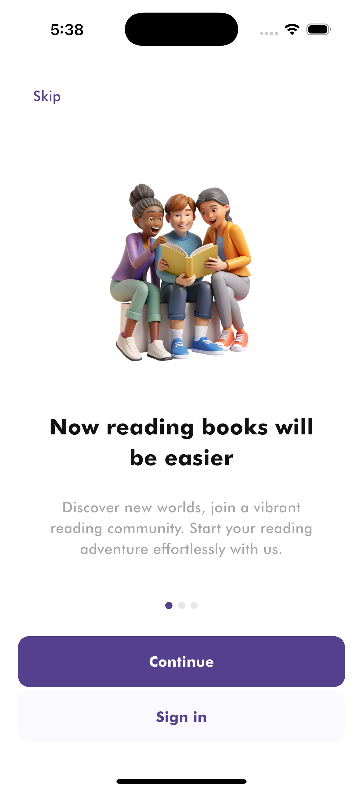
  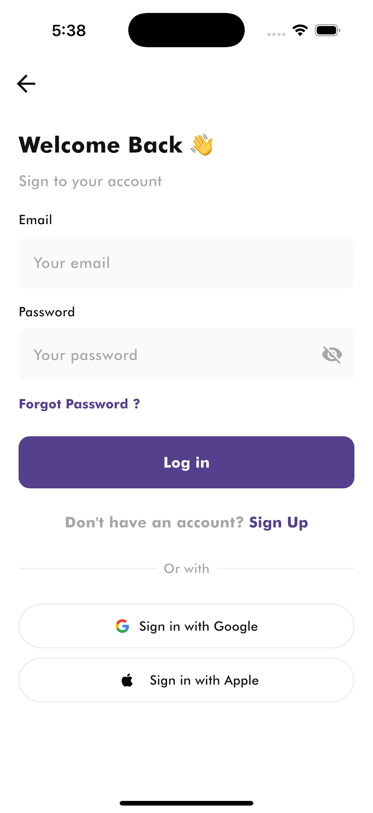
  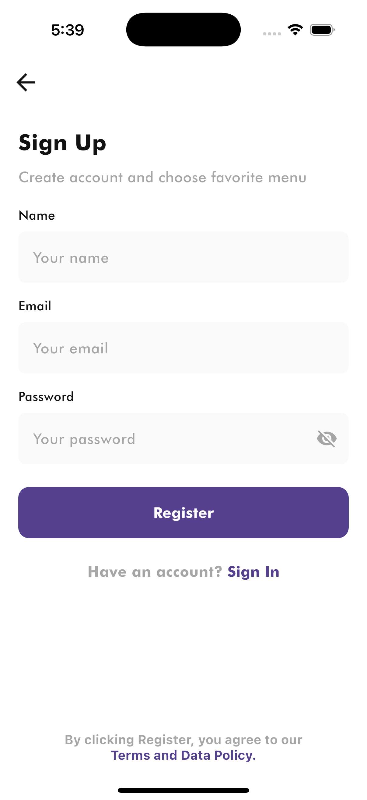
</p>

<p align="center">
    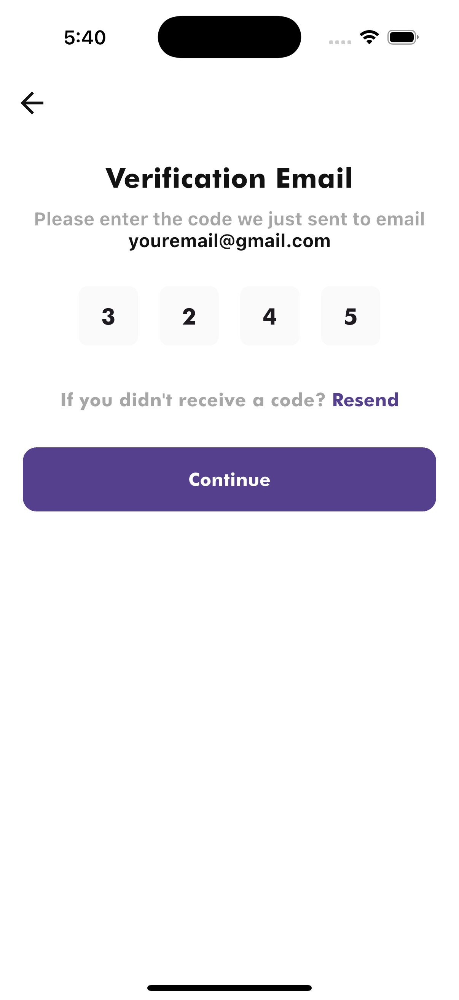
  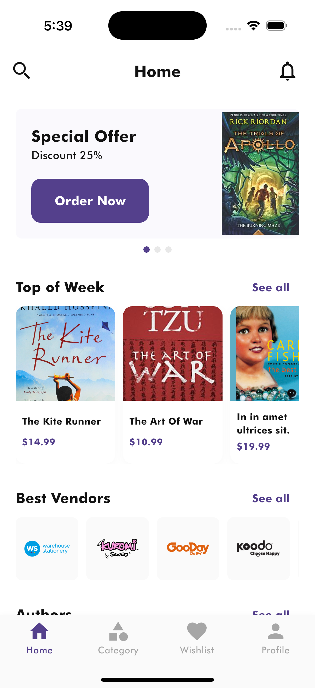
  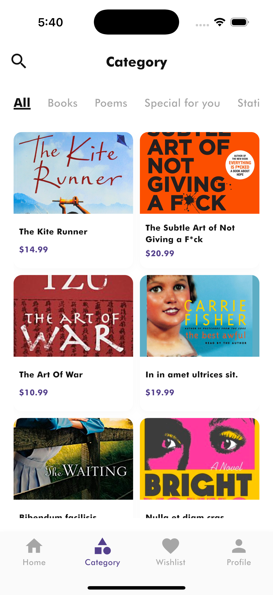
</p>

<p align="center">
    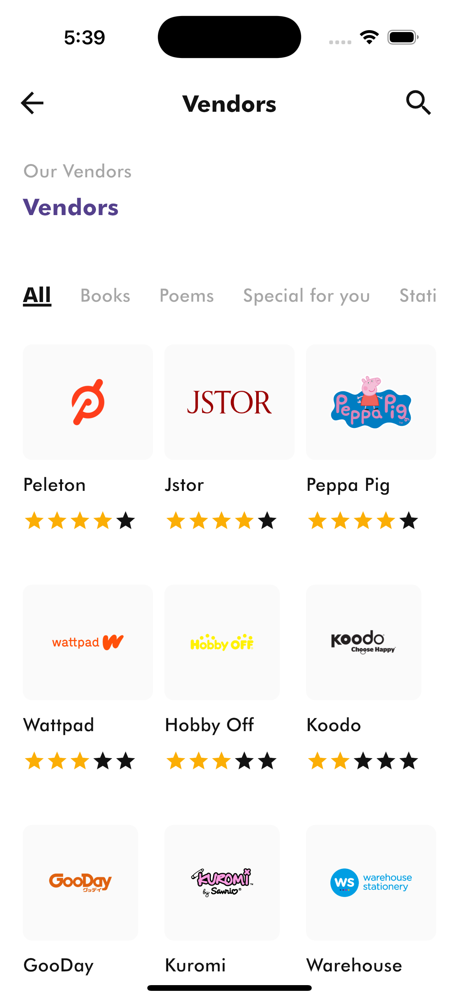
  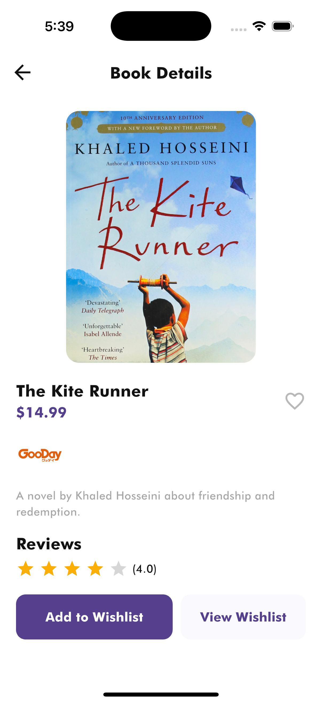
   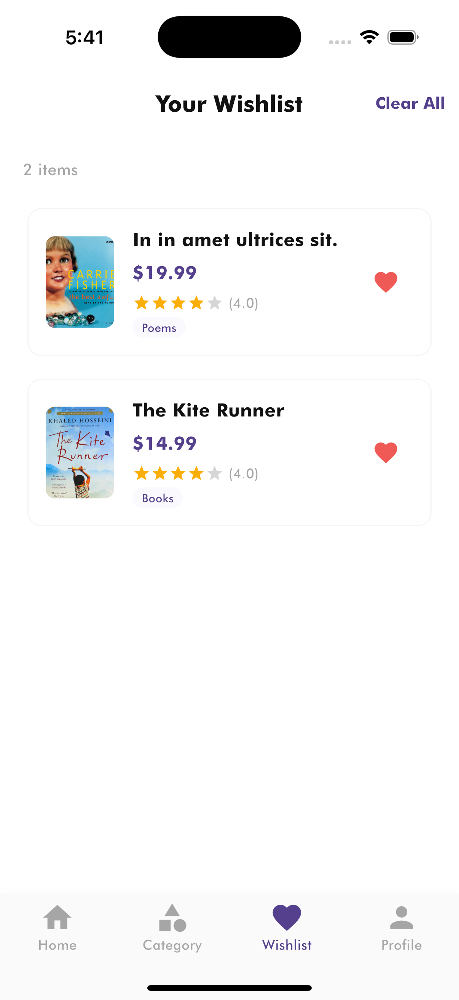
</p>

<p align="center">
    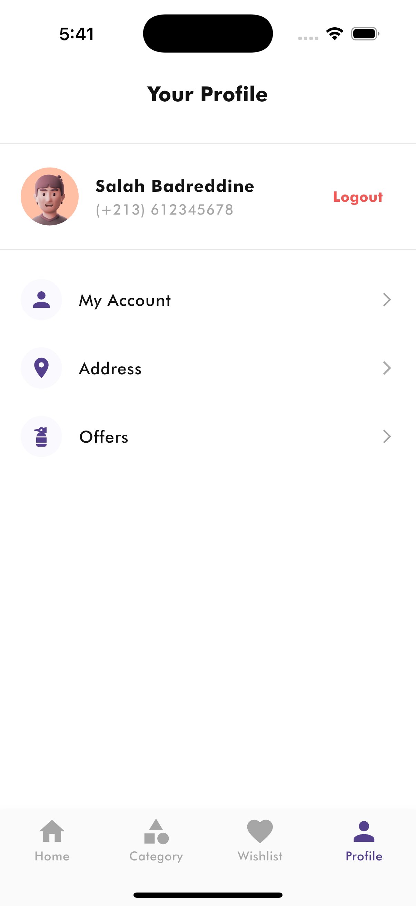
  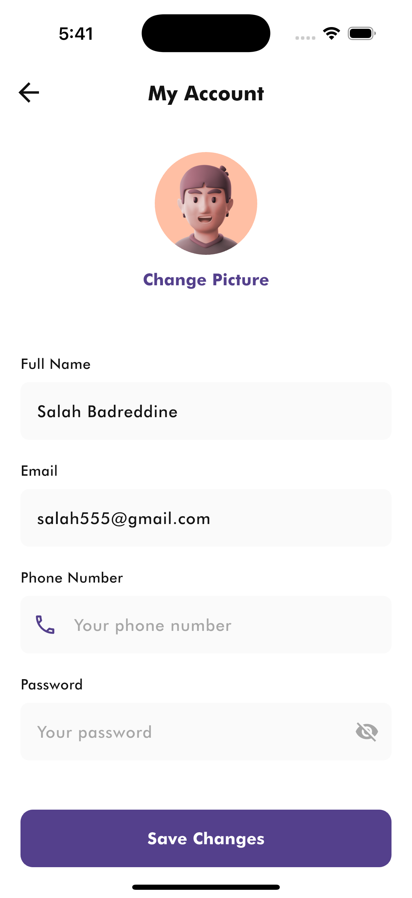
</p>